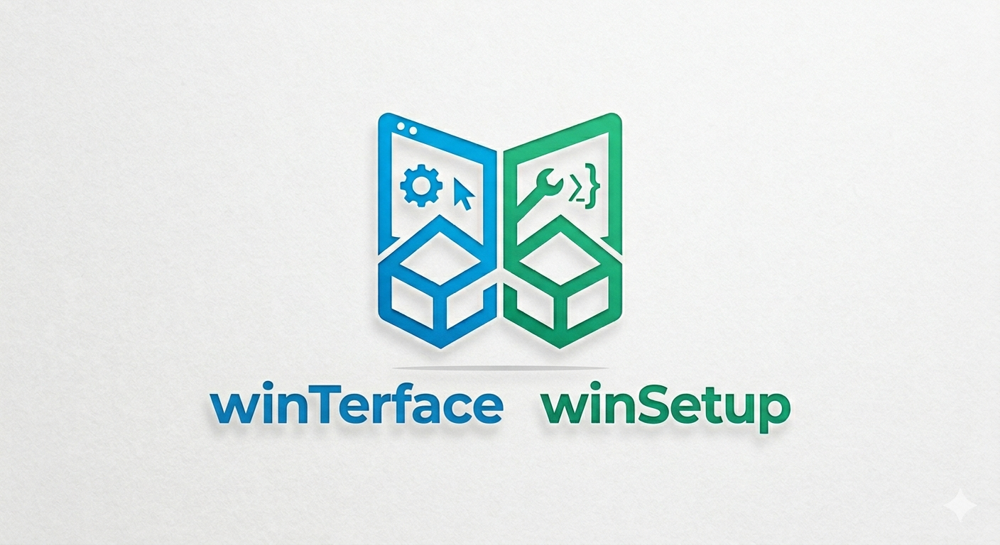
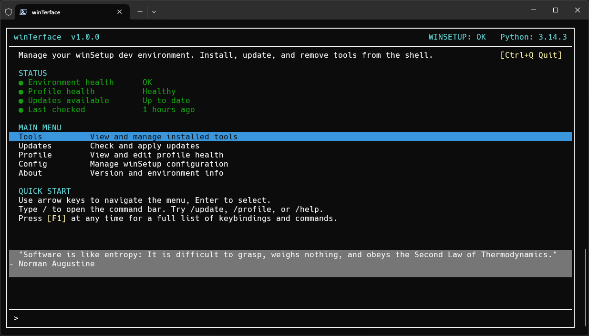

<p align="center">
  
</p>

# winTerface

Terminal UI for managing a Windows 11 development environment configured by [winSetup](https://github.com/megamatman/winSetup). Keyboard-driven, pane-based, with slash commands and background job polling. Replaces manual config file editing, update checking, and tool management with a single interactive console.



## Requirements

- Windows 11
- PowerShell 7+
- [winSetup](https://github.com/megamatman/winSetup) installed and configured (`$env:WINSETUP` set)
- Microsoft.PowerShell.ConsoleGuiTools module (installed automatically by the installer)

## Installation

```powershell
git clone https://github.com/megamatman/winTerface.git
cd winTerface
.\Install-WinTerface.ps1
```

The installer verifies winSetup compatibility, installs ConsoleGuiTools, creates the config directory, sets the `WINTERFACE` environment variable, and adds a `wti` alias to your PowerShell profile. Safe to run multiple times.

Launch with `wti` in any PowerShell 7 session, or run `.\winTerface.ps1` directly.

On first launch, winTerface prompts for the path to your winSetup directory and validates that `Setup-DevEnvironment.ps1` exists before saving.

## Screens

| Screen | Description |
|--------|-------------|
| Home | Status dashboard showing environment health, profile status, update count, and main menu. |
| Updates | Lists available updates from Chocolatey, winget, and pipx. Per-tool or full updates with streaming output. |
| Tools | Inventory of all managed tools with version and status. Install, update, remove, or register new tools. |
| Add Tool | Multi-step wizard for registering a new tool via package search (Chocolatey, winget, PyPI) or manual entry. |
| Profile | Health checks for all expected profile sections, drift detection against the winSetup source, and one-click redeploy. |
| Config | Edit winTerface settings, manage the winSetup path, and view the update cache. |
| About | Version, environment info, and project links. |

## Key bindings

### Global

| Key | Action |
|-----|--------|
| `F1` | Open help overlay |
| `/` | Focus the slash command bar |
| `Tab` | Cycle slash command completion |
| `Esc` | Go back to Home or dismiss overlay |
| `Ctrl+Q` | Quit winTerface |
| `Up` / `Down` | Navigate lists |
| `Enter` | Select or confirm |

### Per screen

| Screen | Key | Action |
|--------|-----|--------|
| Updates | `Space` | Toggle selection on a single update |
| Updates | `A` | Select all updates |
| Updates | `U` | Update selected tools |
| Updates | `F6` | Run full update (all tools) |
| Updates | `F5` | Check for new updates |
| Tools | `A` | Open Add Tool wizard |
| Tools | `I` | Install selected tool |
| Tools | `U` | Update selected tool |
| Tools | `X` | Remove selected tool |
| Tools | `O` | Open install location in Explorer |
| Tools | `F5` | Rescan tool inventory |
| Profile | `R` | Redeploy profile |
| Profile | `D` | View drift diff |
| Profile | `C` | Compare profiles in VS Code |
| Profile | `O` | Open profile in VS Code |
| Profile | `F5` | Refresh health checks |
| Config | `E` | Edit current section |
| Config | `S` | Save settings |
| Config | `V` | Verify winSetup path |
| Config | `C` | Clear update cache |
| Config | `R` | Force update check |
| Config | `T` | Open Tools screen |
| Add Tool | `Tab` | Next search result source |
| Add Tool | `Shift+Tab` | Previous search result source |
| Add Tool | `C` | Confirm changes (confirmation step) |
| Add Tool | `Esc` | Go back one wizard step |

Full reference: [KEYBINDINGS.md](KEYBINDINGS.md)

## Slash commands

Type `/` to open the command bar. `Tab` cycles through completions.

| Command | Action |
|---------|--------|
| `/tools` | Open the Tools screen |
| `/add-tool` | Open the Add Tool wizard |
| `/update` | Open the Updates screen |
| `/check-for-updates` | Force an update check |
| `/profile` | Open the Profile screen |
| `/config` | Open the Config screen |
| `/about` | Show version and environment info |
| `/help` | Show all key bindings and commands |
| `/quit` | Exit winTerface |

## Project structure

```
winTerface/
  winTerface.ps1              Entry point: dependency check, first-run wizard, module loading
  Install-WinTerface.ps1      Installer: PS7 check, ConsoleGuiTools, config dir, env var, alias

  src/
    App.ps1                   Terminal.Gui bootstrap, layout, help overlay, background poll timer
    Config.ps1                Config file read/write/validation (~/.winTerface/config.json)
    Commands.ps1              Slash command registry, fuzzy matching, tab completion
    Navigation.ps1            Screen switching, global key handler, command bar, autocomplete

    Helpers/
      Elevation.ps1           Admin/elevation check
      UI.ps1                  Colour schemes, status labels, backup pruning

    Services/
      WinSetup.ps1            winSetup interface: path validation, profile health, drift, updates
      PackageManager.ps1      Chocolatey, winget, pipx, PyPI query and search functions
      UpdateCache.ps1         Background update checking, cache file management
      ToolWriter.ps1          Code generation for new tools, atomic file writes

    Screens/
      Home.ps1                Dashboard with status panel and main menu
      Updates.ps1             Update management with per-tool and full updates
      Tools.ps1               Tool inventory with install, update, remove actions
      AddTool.ps1             Multi-step wizard: search or guided entry
      AddTool-Search.ps1      Search wizard path: job management, result sections, descriptions
      AddTool-Guided.ps1      Guided wizard steps, field validation, AllowedPattern handling
      Profile.ps1             Health checks, drift detection, redeploy
      Config.ps1              Settings editor, path management, cache viewer
      About.ps1               Version and environment info
      quotes.txt              Inspirational quotes data file for the home screen

  tests/
    ToolWriter.Tests.ps1      Pester tests for code generation
    PackageManager.Tests.ps1  Pester tests for choco/winget/pipx output parsing and search
    Commands.Tests.ps1        Pester tests for fuzzy matching, scoring, tab completion
    Config.Tests.ps1          Pester tests for interval validation, path validation, read/write
    UpdateCache.Tests.ps1     Pester tests for ISO 8601 date handling, staleness, structure
    WinSetup.Tests.ps1        Pester tests for KnownTools registry parsing and metadata merge

  docs/
    how-to-add-a-tool.md      Guide to registering tools via the wizard
    how-to-manage-profile.md  Guide to profile health and redeployment
```

## Verifying files

SHA256 checksums for all source and data files are published in `checksums.sha256`. To verify a file before running it:

```powershell
(Get-FileHash winTerface.ps1 -Algorithm SHA256).Hash
```

Compare the output against the corresponding entry in `checksums.sha256`. Regenerate checksums before each release with `.\New-Checksums.ps1`.

## Documentation

- [Key bindings reference](KEYBINDINGS.md)
- [Troubleshooting](TROUBLESHOOTING.md)
- [How to add a tool](docs/how-to-add-a-tool.md)
- [How to manage your profile](docs/how-to-manage-profile.md)
- [Release notes](RELEASE-NOTES.md)
- [Contributing](CONTRIBUTING.md)
